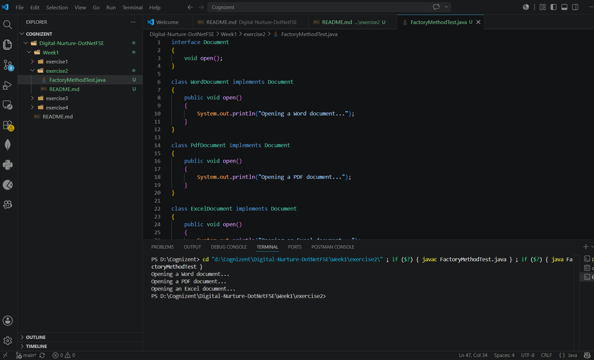

# Exercise 2: Implementing the Factory Method Pattern

## Objective

The objective of this exercise is to implement the Factory Method Design Pattern in Java. The Factory Method Pattern provides an interface for creating objects while allowing subclasses to determine the specific type of object to be created.

---

## Scenario

A document management system needs to support multiple document types such as Word Documents, PDF Documents, and Excel Documents. Instead of directly creating document objects using constructors, the Factory Method Pattern is used to delegate object creation to specialized factory classes.

This approach improves flexibility, maintainability, and scalability of the application.

---

## Steps Performed

### 1. Create a New Java Project

A Java project named **FactoryMethodPatternExample** was created.

### 2. Define Document Interface

A common interface named **Document** was created to represent all document types.

### 3. Create Concrete Document Classes

The following document classes were implemented:

* WordDocument
* PdfDocument
* ExcelDocument

Each class implements the Document interface and provides its own implementation.

### 4. Implement the Factory Method

An abstract class named **DocumentFactory** was created with an abstract method:

```java
createDocument()
```

Concrete factory classes were then created:

* WordDocumentFactory
* PdfDocumentFactory
* ExcelDocumentFactory

Each factory creates and returns its corresponding document object.

### 5. Test the Implementation

A test class was developed to demonstrate the creation of different document types using their respective factory classes.

---

## Benefits of Factory Method Pattern

* Encapsulates object creation logic.
* Promotes loose coupling between client and objects.
* Improves code maintainability.
* Makes it easy to add new document types.
* Follows the Open/Closed Principle.

---

## Expected Output

The application successfully creates different document types using factory classes and displays messages indicating the creation of Word, PDF, and Excel documents.

---

## Conclusion

The Factory Method Pattern was successfully implemented to create different document types through dedicated factory classes. The pattern provides a flexible and extensible approach to object creation while reducing dependency on concrete classes.

