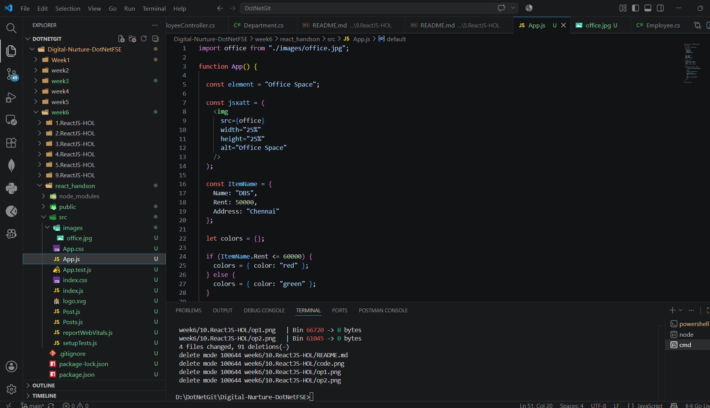
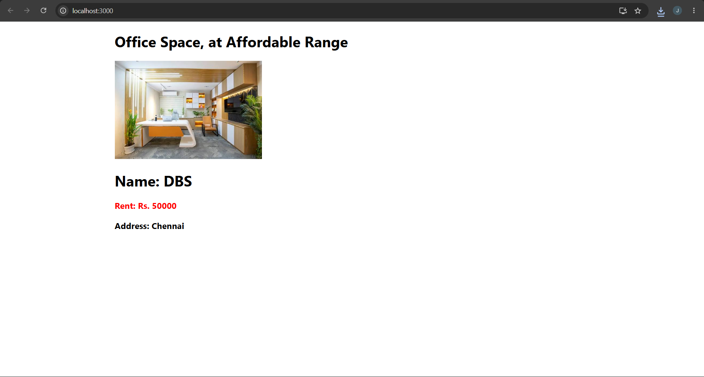

# Office Space Rental App – React JSX

## Objective

- Understand JSX in React.
- Learn how to create React elements using JSX.
- Use JavaScript expressions inside JSX.
- Apply inline CSS styling.
- Render JSX elements to the DOM.

---

## Technologies Used

- React
- JavaScript (ES6)
- JSX
- Node.js
- npm
- Visual Studio Code

---

## Prerequisites

- Node.js installed
- npm installed
- Visual Studio Code

---

## Implementation

### Task 1 – Create React Application

- Created a React application named **officespacerentalapp** using Create React App.

---

### Task 2 – Create JSX Elements

- Created a JSX heading to display **Office Space, at Affordable Range**.
- Displayed an office image using the `img` element.

---

### Task 3 – Display Office Details

- Created an object containing:
  - Office Name
  - Rent
  - Address
- Displayed the office details using JSX expressions.

---

### Task 4 – Apply Inline CSS

- Used conditional inline styling.
- Displayed the Rent amount in:
  - **Red** when Rent is less than or equal to **60000**
  - **Green** when Rent is greater than **60000**

---

## Output

### Task 1 – Office Space Details

 

Displays:
- Office Space heading
- Office image
- Office Name
- Rent (with conditional color)
- Office Address

---

## Result

Successfully created a React application using **JSX**, **JavaScript expressions**, **objects**, and **inline CSS** to display office space rental details.