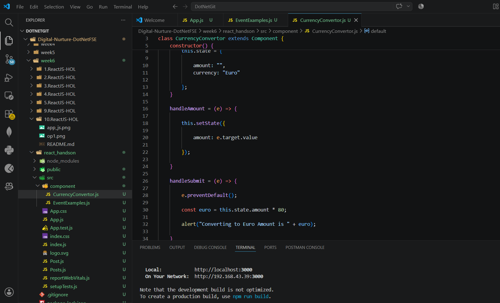
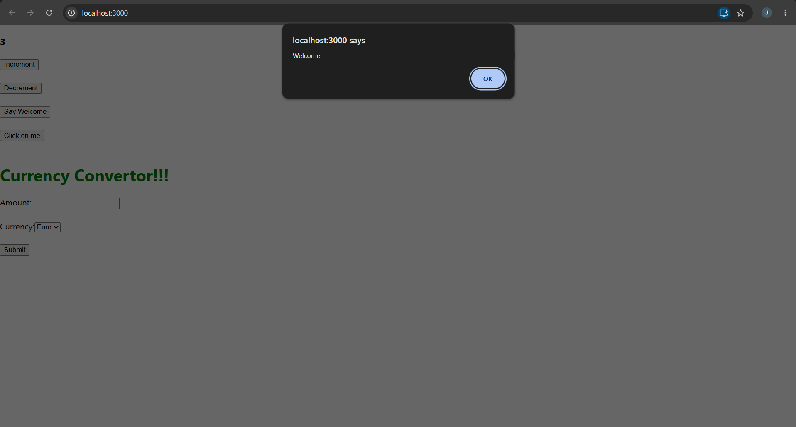
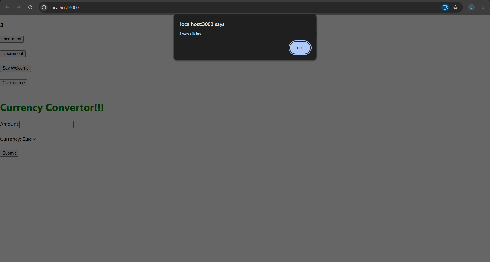
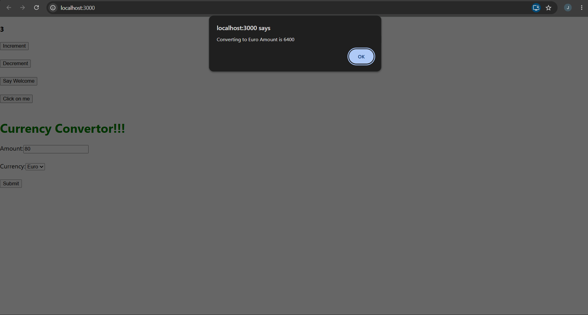

# Event Examples App – React Event Handling

## Objective

- Understand React event handling.
- Learn about event handlers and synthetic events.
- Use the `this` keyword in class components.
- Handle button click events.
- Implement a simple currency converter using event handling.

---

## Technologies Used

- React
- JavaScript (ES6)
- Node.js
- npm
- Visual Studio Code

---

## Prerequisites

- Node.js installed
- npm installed
- Visual Studio Code

---

## Implementation

### Task 1 – Create React Application

- Created a React application named **eventexamplesapp**.

---

### Task 2 – Counter Events

- Implemented **Increment** and **Decrement** buttons.
- Increment button increases the counter value.
- Increment button also displays a **Hello** message by invoking multiple methods.
- Decrement button decreases the counter value.

---

### Task 3 – Welcome Event

- Created a **Say Welcome** button.
- Passed **"Welcome"** as an argument to the event handler.
- Displayed the welcome message using an alert.

---

### Task 4 – Synthetic Event

- Created a **Click on me** button.
- Used the `onClick` synthetic event.
- Displayed **"I was clicked"** when the button was clicked.

---

### Task 5 – Currency Converter

- Created a **CurrencyConvertor** component.
- Accepted the amount from the user.
- Converted the amount using the click event.
- Displayed the converted value in an alert box.

---

## Output

### Task 1 – Welcome Message

### Task 2 – Synthetic Event

### Task 3 – Currency Converter

---

## Result

Successfully implemented React event handling concepts including **multiple event handlers**, **passing arguments**, **synthetic events**, and a simple **Currency Converter** using React class components.