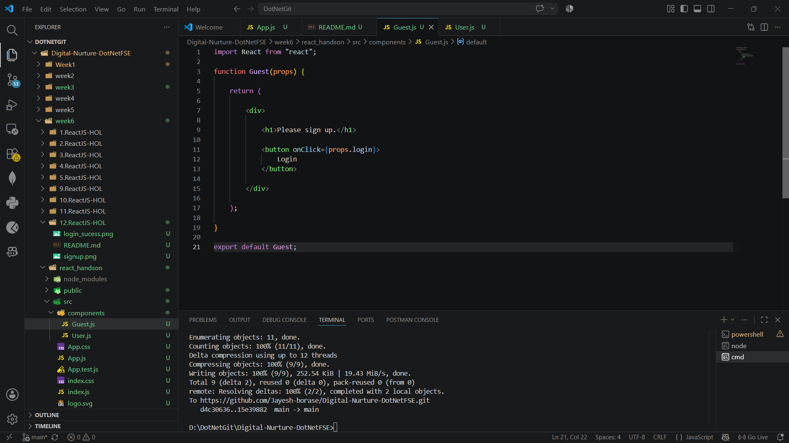
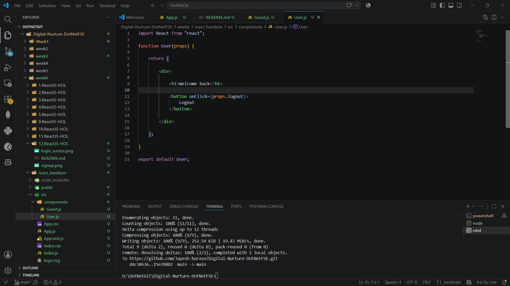
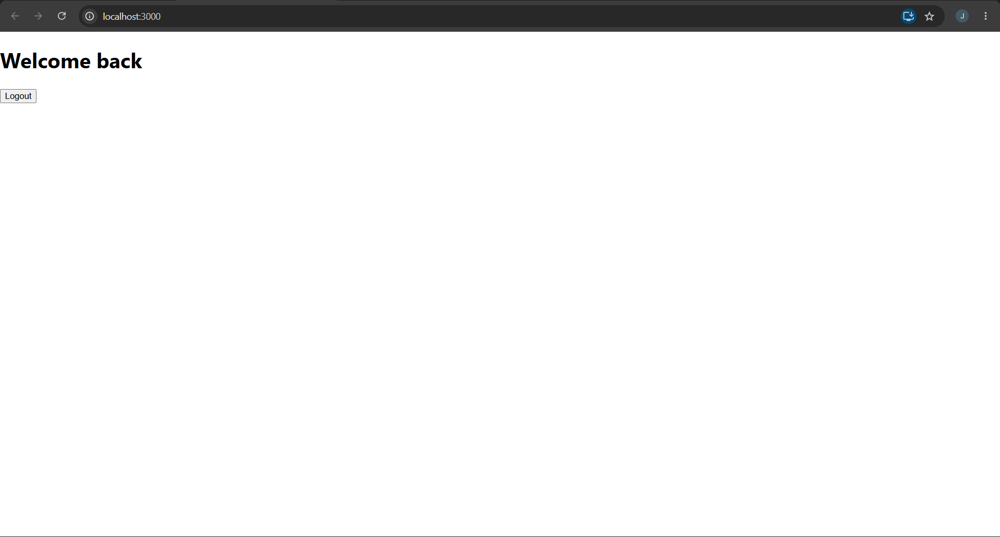

# Ticket Booking App – React Conditional Rendering

## Objective

- Understand conditional rendering in React.
- Learn how to display different components based on user login status.
- Implement Login and Logout functionality.

---

## Technologies Used

- React
- JavaScript (ES6)
- Node.js
- npm
- Visual Studio Code

---

## Prerequisites

- Node.js installed
- npm installed
- Visual Studio Code

---

## Implementation

### Task 1 – Create React Application

- Created a React application named **ticketbookingapp**.

---

### Task 2 – Guest Component

- Created a **Guest** component.
- Displayed the message **"Please sign up."**
- Added a **Login** button.

---

### Task 3 – User Component

- Created a **User** component.
- Displayed the message **"Welcome back"**.
- Added a **Logout** button.

---

### Task 4 – Conditional Rendering

- Used a boolean state variable to determine whether the user is logged in.
- Displayed the **Guest** component when the user is not logged in.
- Displayed the **User** component after successful login.
- Clicking **Logout** returns the user to the Guest page.

---

## Output

### Task 1 – Guest Page (Login)

Displays:
- **Please sign up.**
- **Login** button

### Task 2 – User Page (After Login)

Displays:
- **Welcome back**
- **Logout** button

---

## Result

Successfully implemented **Conditional Rendering** in React by displaying different components for Guest and Logged-in users using Login and Logout buttons.