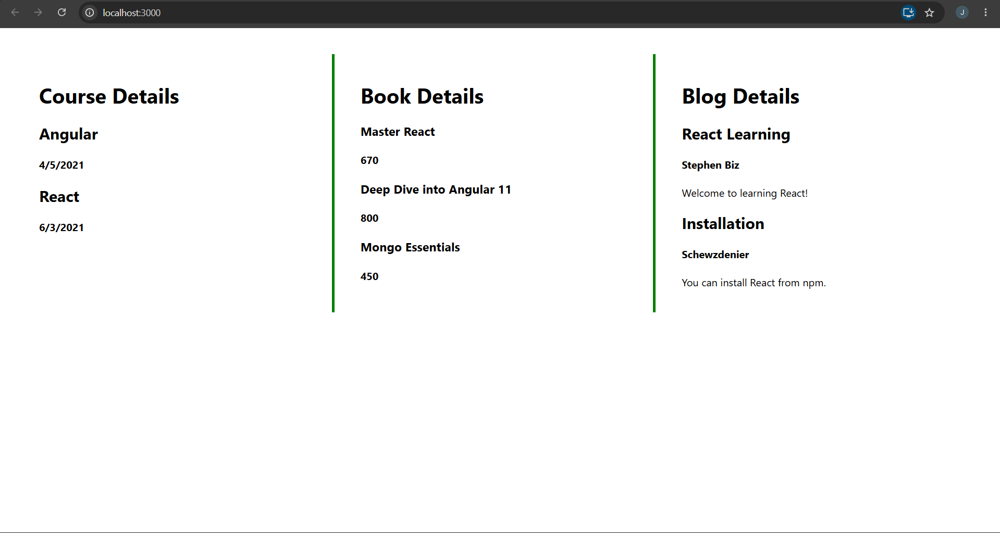

# Blogger App 14 – React Conditional Rendering

## Objective

- Understand conditional rendering in React.
- Render multiple components in a React application.
- Display lists using the `map()` function.
- Use keys while rendering lists.

---

## Technologies Used

- React
- JavaScript (ES6)
- Node.js
- npm
- Visual Studio Code

---

## Prerequisites

- Node.js installed
- npm installed
- Visual Studio Code

---

## Implementation

### Task 1 – Create React Application

- Created a React application named **bloggerapp**.

---

### Task 2 – Course Details Component

- Created a **CourseDetails** component.
- Displayed the list of available courses using the `map()` function.

---

### Task 3 – Book Details Component

- Created a **BookDetails** component.
- Displayed book names and prices using list rendering.

---

### Task 4 – Blog Details Component

- Created a **BlogDetails** component.
- Displayed blog title, author, and description using `map()`.

---

### Task 5 – Conditional Rendering

- Rendered all three components using different conditional rendering techniques.
- Used:
  - Ternary Operator (`condition ? component : null`)
  - Logical AND (`condition && component`)

---

### Task 6 – Styling

- Displayed all three components side by side.
- Added green vertical divider lines between the sections using inline CSS.

---

## Output

### Blogger Application

Displays **Course Details**, **Book Details**, and **Blog Details** in three separate sections with green divider lines.

---

## Result

Successfully implemented **Conditional Rendering**, **List Rendering**, **React map()**, and **Keys** by displaying multiple components in a single React application.