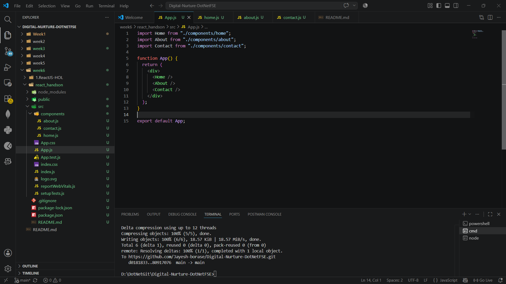

# Hands-On 2 – Creating Multiple React Components

## Objective

The objective of this hands-on is to create multiple React components and render them in a single application using class components.

---

# Prerequisites

- Node.js
- npm (Node Package Manager)
- Visual Studio Code
- React Application (react_handson)

---

# Implementation

## Task 1 – Create React Components

Created the following class components inside the **components** folder:

- Home
- About
- Contact

---

## Task 2 – Implement Home Component

Created the **Home** component to display the Home page message.

```jsx
import React, { Component } from "react";

class Home extends Component {
    render() {
        return (
            <div>
                <h3>Welcome to the Home Page of Student Management Portal</h3>
            </div>
        );
    }
}

export default Home;
```

---

## Task 3 – Implement About Component

Created the **About** component to display the About page message.

---

## Task 4 – Implement Contact Component

Created the **Contact** component to display the Contact page message.

---

## Task 5 – Render Components in App.js

Imported all three components into **App.js** and rendered them.

```jsx
import Home from "./components/home";
import About from "./components/about";
import Contact from "./components/contact";

function App() {
  return (
    <div>
      <Home />
      <About />
      <Contact />
    </div>
  );
}

export default App;
```



---

## Task 6 – Run the Application

Executed the React application using:

```bash
npm start
```

---

# Output

### Student Management Portal Web Page


---

# Conclusion

Through this hands-on, I learned how to create reusable React class components, import them into the main application, and render multiple components together in a single React application.