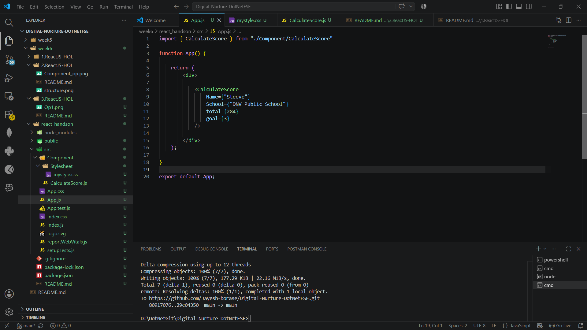
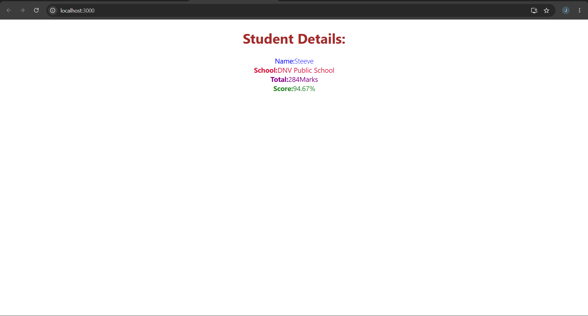

# Hands-On 3 – React Functional Component with Props and CSS

## Objective

The objective of this hands-on is to create a React functional component, pass data using props, perform simple calculations, and apply CSS styling to the component.

---

# Prerequisites

- Node.js
- npm (Node Package Manager)
- Visual Studio Code
- React Application (react_handson)

---

# Implementation

## Task 1 – Create Functional Component

Created a functional component named **CalculateScore** inside the `components` folder.

The component accepts the following props:

- Name
- School
- Total Marks
- Goal

---

## Task 2 – Calculate Student Score

Implemented helper functions to calculate the percentage score.


```javascript
const percentToDecimal = (decimal) => {
    return decimal.toFixed(2) + "%";
}

const calcScore = (total, goal) => {
    return percentToDecimal(total / goal);
}

```

---

## Task 3 – Display Student Details

Displayed the following information using JSX:

- Student Name
- School Name
- Total Marks
- Calculated Score

---

## Task 4 – Apply CSS Styling

Created a stylesheet named **mystyle.css** inside the `Stylesheets` folder and applied different styles for:

- Name
- School
- Total Marks
- Score
- Overall Component Layout

---

## Task 5 – Render the Component

Imported the `CalculateScore` component into `App.js` and passed the required props.

```jsx
<CalculateScore
    Name={"Steeve"}
    School={"DNV Public School"}
    total={284}
    goal={3}
/>
```


---

## Task 6 – Run the Application

Executed the application using:

```bash
npm start
```

---

# Output

### Student Score Web Page



---

# Conclusion

Through this hands-on, I learned how to create React functional components, pass data using props, perform simple calculations inside a component, apply CSS styling, and render the component in a React application.