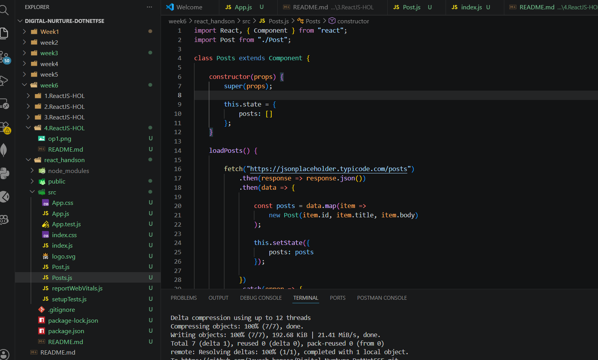
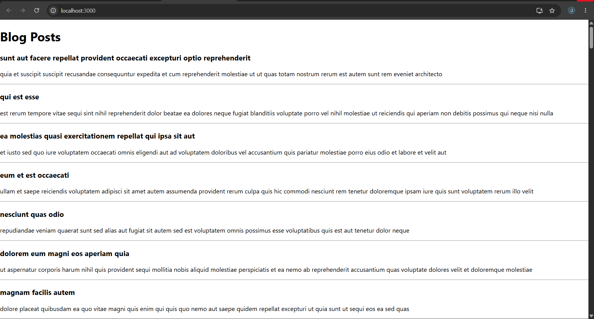

# Hands-On 4 – React Component Lifecycle Methods

## Objective

The objective of this hands-on is to understand the React component lifecycle by implementing lifecycle methods such as `componentDidMount()` and `componentDidCatch()`, and fetching data using the Fetch API.

---

# Prerequisites

- Node.js
- npm (Node Package Manager)
- Visual Studio Code
- React Application (blogapp)

---

# Implementation

## Task 1 – Create Post Class

Created a `Post` class to represent blog post data.

---

## Task 2 – Create Posts Component

Created a class component named **Posts** and initialized the component state using the constructor.

---

## Task 3 – Load Posts Using Fetch API

Implemented the `loadPosts()` method to fetch blog posts from the JSON Placeholder API.

```javascript
fetch("https://jsonplaceholder.typicode.com/posts")
```

---

## Task 4 – Implement componentDidMount()

Called the `loadPosts()` method inside the `componentDidMount()` lifecycle hook to load the posts when the component is rendered.

```javascript
componentDidMount() {
    this.loadPosts();
}
```

---

## Task 5 – Display Posts

Implemented the `render()` method to display the title and body of each post using headings and paragraphs.

---

## Task 6 – Implement componentDidCatch()

Implemented the `componentDidCatch()` lifecycle hook to display an alert whenever an error occurs in the component.

```javascript
componentDidCatch(error, info) {
    alert(error);
}
```

---

## Task 7 – Render Posts Component

Imported the `Posts` component into `App.js` and rendered it.

```jsx
<Posts />
```

---

## Task 8 – Run the Application

Executed the React application using:

```bash
npm start
```

---

# Output

### Blog Posts Web Page



---

# Conclusion

Through this hands-on, I learned how to implement React lifecycle methods, fetch data using the Fetch API, manage component state, render dynamic data, and handle runtime errors using `componentDidCatch()`.