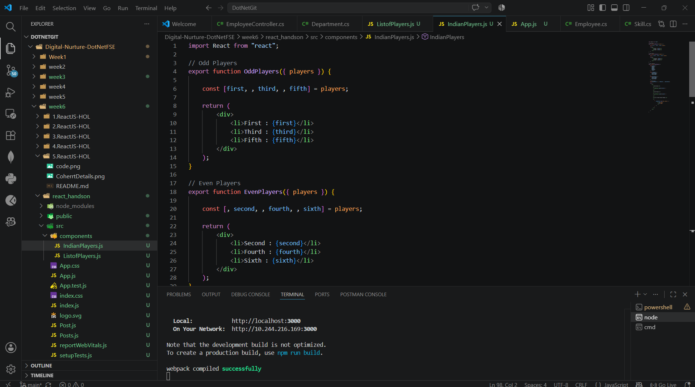
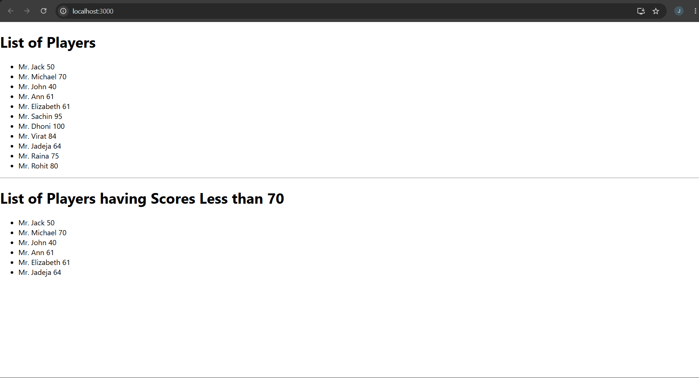
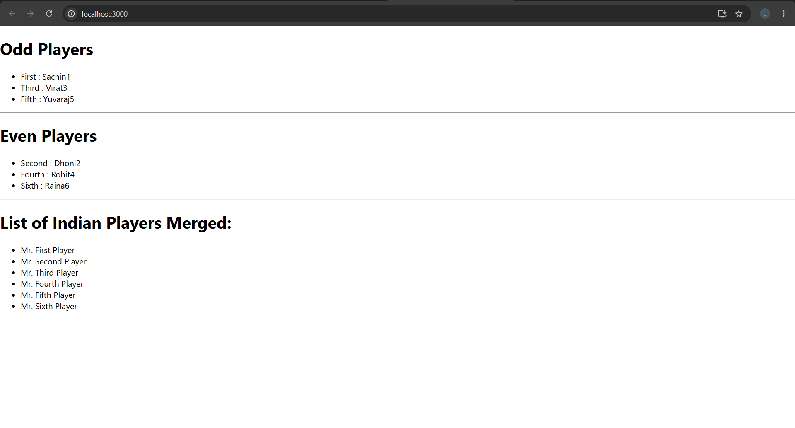

# Cricket App 9– ES6 Features in React

## Objective

- Understand ES6 features in JavaScript.
- Learn the difference between `var`, `let`, and `const`.
- Implement ES6 arrow functions.
- Use `map()` for rendering lists.
- Use array destructuring.
- Merge arrays using the spread (`...`) operator.

---

## Technologies Used

- React
- JavaScript (ES6)
- Node.js
- npm
- Visual Studio Code

---

## Prerequisites

- Node.js installed
- npm installed
- Visual Studio Code

---

## Implementation

### Task 1 – Create React Application

- Created a React application named **cricketapp**.
- Opened the project in Visual Studio Code.

---

### Task 2 – List of Players Component

- Created an array containing **11 players** with their names and scores.
- Displayed the player list using the **map()** method.
- Filtered players having scores less than **70** using **ES6 arrow functions**.

---

### Task 3 – Indian Players Component

- Used **array destructuring** to display **Odd Team Players** and **Even Team Players**.
- Declared **T20Players** and **RanjiTrophyPlayers** arrays.
- Merged both arrays using the **spread (`...`) operator**.
- Displayed the merged list of players.

---

### Task 4 – Conditional Rendering

- Used a boolean **flag** variable.
- When `flag = true`, displayed the **List of Players**.
- When `flag = false`, displayed the **Indian Players** component.

---

## Output

### Task 1 – Player List (Flag = true)

Displays:
- List of all players
- Players with scores less than 70

### Task 2 – Indian Players (Flag = false)

Displays:
- Odd Team Players
- Even Team Players
- Merged list of Indian Players

---

## Result

Successfully created a React application demonstrating ES6 features including **map()**, **arrow functions**, **array destructuring**, **spread operator**, and **conditional rendering**.