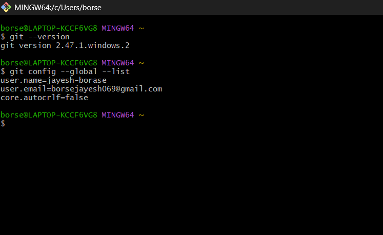
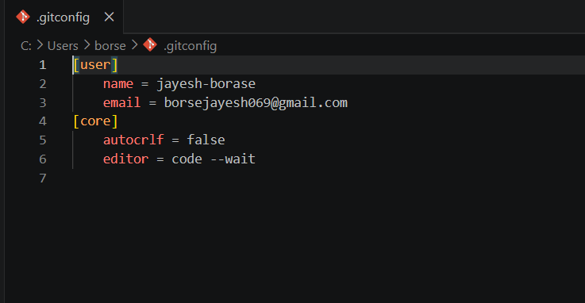
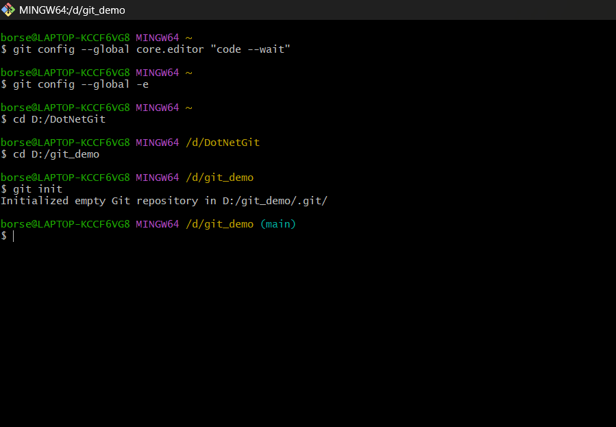
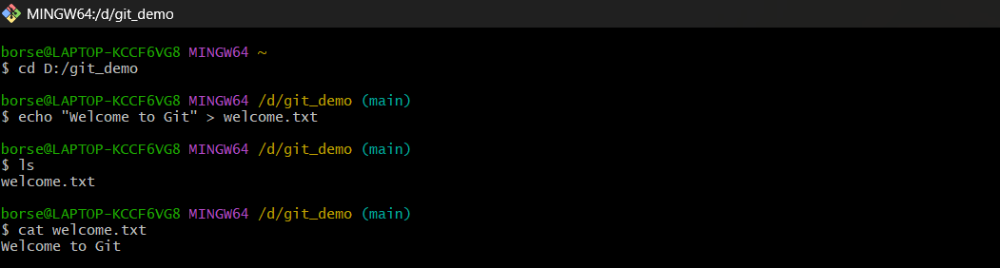
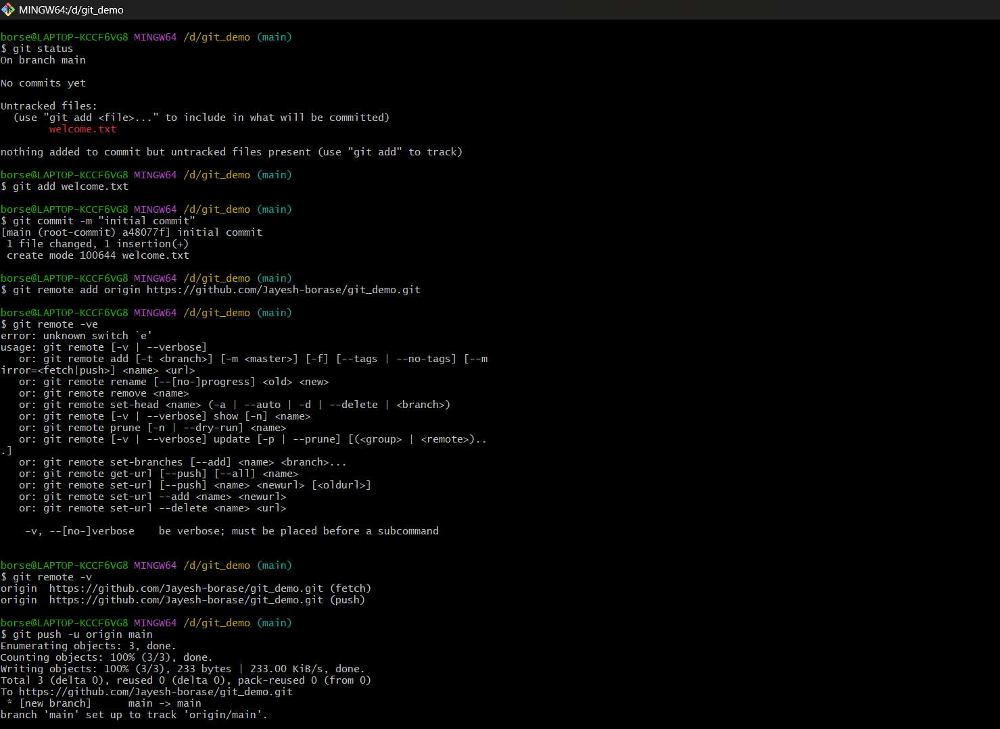

# Git Hands-on Lab 1 – Git Configuration and Repository Management

## Objective

- Configure Git on the local machine.
- Set Visual Studio Code as the default Git editor.
- Initialize a local Git repository.
- Create and track files using Git.
- Commit changes to the local repository.
- Connect the local repository to a remote repository.

---

## Technologies Used

- Git
- Git Bash
- Visual Studio Code
- GitHub / GitLab

---

## Prerequisites

- Git installed
- Visual Studio Code installed
- GitHub/GitLab account

---

## Implementation

### Task 1 – Verify Git Installation

- Verified Git installation using the version command.
- Verified the configured username and email.

---

### Task 2 – Configure Default Editor

- Configured **Visual Studio Code** as the default Git editor.

Command used:

```bash
git config --global core.editor "code --wait"
```

---

### Task 3 – Initialize Repository

- Created a project folder named **GitDemo**.
- Initialized it as a Git repository.

Commands used:

```bash
mkdir GitDemo
cd GitDemo
git init
```

---

### Task 4 – Create and Track File

- Created a file named **welcome.txt**.
- Added sample content.
- Added the file to the staging area.

Commands used:

```bash
echo "Welcome to Git" > welcome.txt
git add welcome.txt
```

---

### Task 5 – Commit Changes

- Committed the staged file to the local repository.

Command used:

```bash
git commit -m "Initial Commit"
```

---

### Task 6 – Connect Remote Repository

- Created a remote repository on GitHub/GitLab.
- Added the remote repository.
- Pulled and pushed changes.

Commands used:

```bash
git remote add origin <repository-url>
git pull origin main
git push -u origin main
```

---

## Output

### 1. Git Configuration

- Verified Git username and email configuration.



---

### 2. Default Editor Configuration

- Successfully configured Visual Studio Code as the default Git editor.



---

### 3. Git Repository Initialization

- Successfully initialized the GitDemo repository.



---

### 4. Welcome File Creation

- Successfully created the `welcome.txt` file.



---

### 5. File Added to Repository

- Successfully added the file to the Git staging area.



---

## Result

Successfully configured Git, initialized a local repository, created and tracked files, committed changes, configured Visual Studio Code as the default Git editor, and connected the local repository with a remote repository.