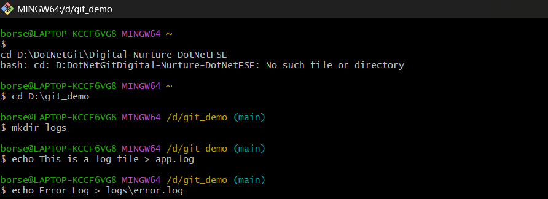
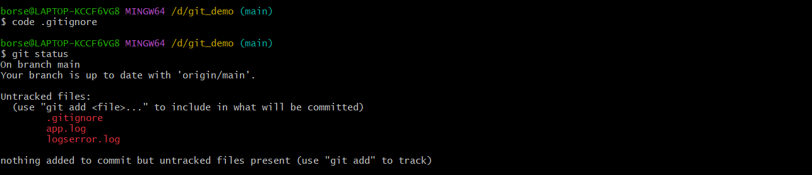
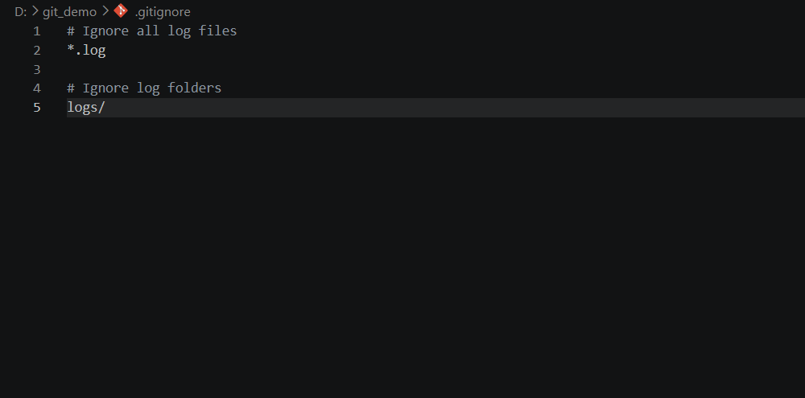
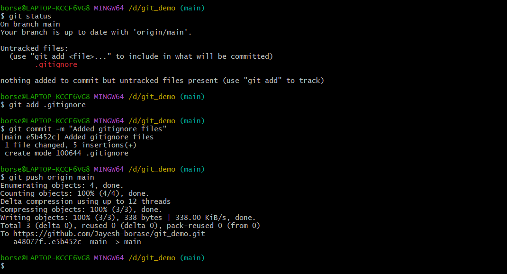

# Git Hands-on Lab 2 – Using Git Ignore

## Objective

- Understand the purpose of `.gitignore`.
- Ignore unwanted files and folders from Git tracking.
- Prevent `.log` files and `logs` folders from being committed.
- Verify ignored files using Git status.

---

## Technologies Used

- Git
- Git Bash
- Visual Studio Code
- GitHub / GitLab

---

## Prerequisites

- Git installed and configured
- Visual Studio Code installed
- Local Git repository
- GitHub/GitLab account

---

## Implementation

### Task 1 – Create Log Files and Folder

- Created a folder named **logs**.
- Created a log file with `.log` extension.

Commands used:

```bash
mkdir logs
echo "Sample Log File" > logs/error.log
```

---

### Task 2 – Create `.gitignore`

- Created a `.gitignore` file in the project root.
- Added rules to ignore log files and log folders.

Contents of `.gitignore`:

```text
*.log
logs/
```

---

### Task 3 – Verify Git Status

- Verified that Git ignores the `.log` files and `logs` folder.

Command used:

```bash
git status
```

---

### Task 4 – Add `.gitignore`

- Added the `.gitignore` file to the staging area.

Command used:

```bash
git add .gitignore
```

---

### Task 5 – Commit and Push Changes

- Committed the `.gitignore` file.
- Pushed the changes to the remote repository.

Commands used:

```bash
git commit -m "Added .gitignore file"
git push origin main
```

---

## Output

### 1. Created Log Folder and Log File

- Successfully created the `logs` folder and `.log` file.



---

### 2. Created `.gitignore` File

- Successfully created the `.gitignore` file with ignore rules.



---

### 3. Added `.gitignore` to Staging Area

- Successfully added the `.gitignore` file to Git.


---

### 4. Commit and Push Successful

- Successfully committed and pushed the `.gitignore` configuration to the remote repository.

---

## Result

Successfully implemented Git Ignore by creating a `.gitignore` file to ignore all `.log` files and `logs` folders. Verified that ignored files were not tracked by Git and successfully committed and pushed the changes to the remote repository.