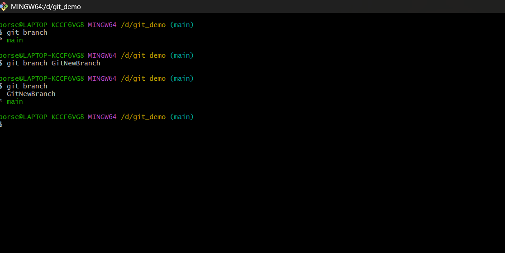
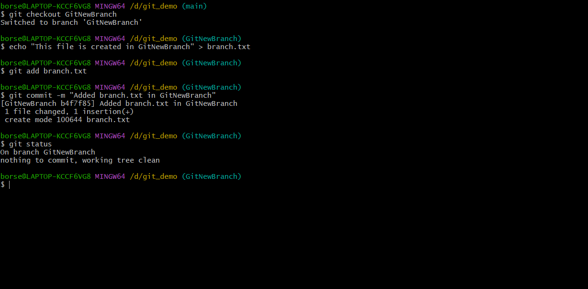
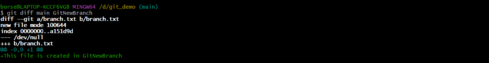
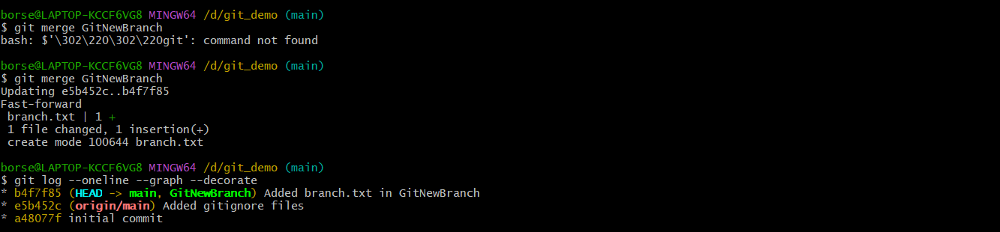
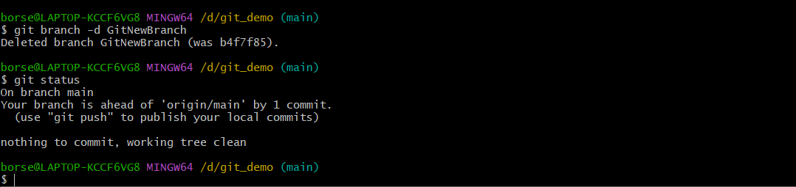

# Git Hands-on Lab 3 – Branching and Merging

## Objective

- Understand Git branching and merging concepts.
- Create a new branch and switch between branches.
- Commit changes in a separate branch.
- Compare differences between branches.
- Merge branch changes into the main branch.
- Delete the merged branch.

---

## Technologies Used

- Git
- Git Bash
- Visual Studio Code
- GitHub

---

## Prerequisites

- Git installed and configured
- Visual Studio Code installed
- Existing local Git repository
- GitHub account

---

## Implementation

### Task 1 – Create a New Branch

- Created a new branch named **GitNewBranch**.

Command used:

```bash
git branch GitNewBranch
git checkout GitNewBranch
```

---

### Task 2 – Add a File to the Branch

- Created a new file named **branch.txt**.
- Added the file to the staging area.
- Committed the changes.

Commands used:

```bash
echo "This file is created in GitNewBranch" > branch.txt
git add branch.txt
git commit -m "Added branch.txt in GitNewBranch"
```

---

### Task 3 – Compare Branches

- Switched back to the **main** branch.
- Compared the differences between the main branch and GitNewBranch.

Command used:

```bash
git diff main GitNewBranch
```

---

### Task 4 – Merge the Branch

- Merged **GitNewBranch** into the **main** branch.

Command used:

```bash
git merge GitNewBranch
```

---

### Task 5 – Delete the Branch

- Deleted the branch after successful merging.

Command used:

```bash
git branch -d GitNewBranch
```

---

## Output

### 1. New Branch Created

- Successfully created and switched to **GitNewBranch**.

---

### 2. File Added and Committed in Branch

- Successfully added a new file and committed it in **GitNewBranch**.



---

### 3. Differences Between Main and Branch

- Successfully displayed the differences between the branches.



---

### 4. Branch Successfully Merged

- Successfully merged **GitNewBranch** into the **main** branch.



---

### 5. Branch Deleted

- Successfully delete the merged branch.


---

## Result

Successfully created a new Git branch, added and committed changes, compared branch differences, merged the branch into the main branch, and deleted the branch after successful merging.