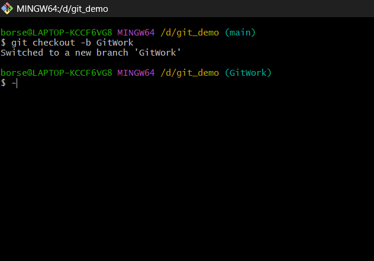
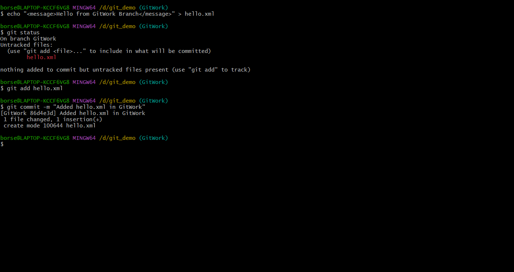
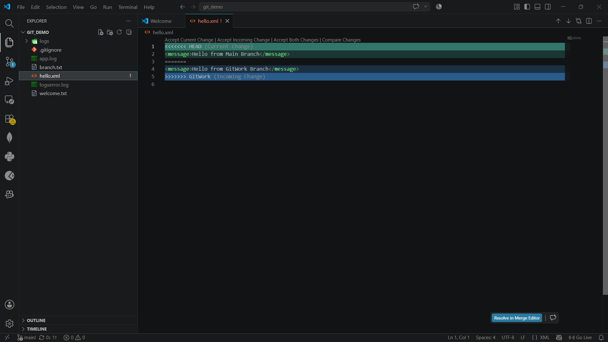
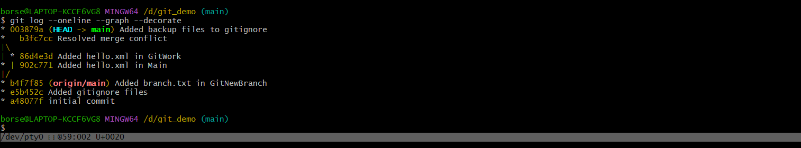

# Git Hands-on Lab 4 – Merge Conflict Resolution

## Objective

- Understand merge conflicts in Git.
- Create a separate branch and modify files.
- Resolve conflicts that occur during merging.
- Commit the resolved changes.
- Update the `.gitignore` file.
- Delete the merged branch and verify the Git log.

---

## Technologies Used

- Git
- Git Bash
- Visual Studio Code
- GitHub

---

## Prerequisites

- Git installed and configured
- Visual Studio Code installed
- Existing Git repository
- GitHub account

---

## Implementation

### Task 1 – Create a New Branch

- Created a new branch named **GitWork**.
- Switched to the newly created branch.

Commands used:

```bash
git checkout -b GitWork
```

---

### Task 2 – Create and Commit hello.xml

- Created the **hello.xml** file.
- Added sample content.
- Added the file to the staging area.
- Committed the changes.

Commands used:

```bash
echo "<message>Hello from GitWork Branch</message>" > hello.xml

git add hello.xml

git commit -m "Added hello.xml in GitWork"
```

---

### Task 3 – Create Conflict

- Switched back to the **main** branch.
- Created another **hello.xml** with different content.
- Committed the changes.
- Attempted to merge the **GitWork** branch, resulting in a merge conflict.

Commands used:

```bash
git checkout main

git merge GitWork
```

---

### Task 4 – Resolve Merge Conflict

- Opened the conflicted file in **Visual Studio Code**.
- Resolved the conflict manually.
- Staged the resolved file.
- Committed the merge.

Commands used:

```bash
git add hello.xml

git commit -m "Resolved merge conflict"
```

---

### Task 5 – View Git Log

- Displayed the final Git commit history.

Command used:

```bash
git log --oneline --graph --decorate
```

---

## Output

### 1. New Branch Created

- Successfully created and switched to the **GitWork** branch.



---

### 2. File Added to GitWork Branch

- Successfully created **hello.xml** and committed it to the branch.



---

### 3. Merge Conflict

- Merge conflict occurred while merging **GitWork** into the **main** branch.


---

### 4. Final Git Log

- Successfully resolved the merge conflict and displayed the final Git commit history.



---

## Result

Successfully created a new branch, introduced a merge conflict, resolved the conflict using Visual Studio Code, committed the resolved changes, and verified the final Git history.