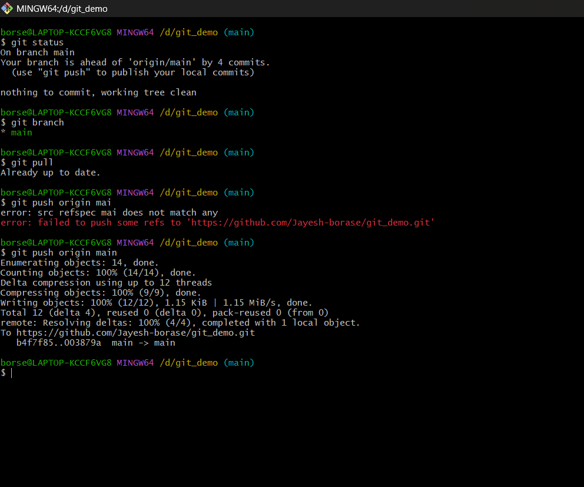

# Git Hands-on Lab 5 – Clean Up and Push to Remote Repository

## Objective

- Verify the working tree is clean.
- List all available Git branches.
- Pull the latest changes from the remote repository.
- Push local commits to the remote repository.
- Verify the changes on the remote GitHub repository.

---

## Technologies Used

- Git
- Git Bash
- Visual Studio Code
- GitHub

---

## Prerequisites

- Git installed and configured
- Visual Studio Code installed
- Existing local Git repository
- GitHub account

---

## Implementation

### Task 1 – Verify Repository Status

- Switched to the **main** branch.
- Verified that the working tree was clean.

Command used:

```bash
git checkout main
git status
```

---

### Task 2 – List Available Branches

- Displayed all available local and remote branches.

Command used:

```bash
git branch -a
```

---

### Task 3 – Pull Latest Changes

- Pulled the latest updates from the remote repository.

Command used:

```bash
git pull origin main
```

---

### Task 4 – Push Local Changes

- Pushed all committed changes from the local repository to the remote GitHub repository.

Command used:

```bash
git push origin main
```

---

### Task 5 – Verify Remote Repository

- Verified that all committed changes were successfully reflected in the GitHub repository.

---

## Output

### Git Repository Successfully Synchronized

- Successfully verified the repository status, listed branches, pulled the latest changes from the remote repository, and pushed all local commits to GitHub.



---

## Result

Successfully cleaned up the local Git repository, synchronized it with the remote repository by pulling and pushing changes, and verified that all updates were successfully reflected on GitHub.
